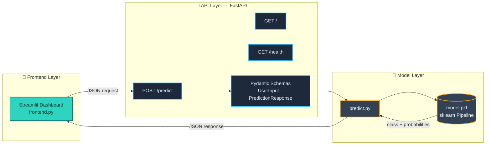
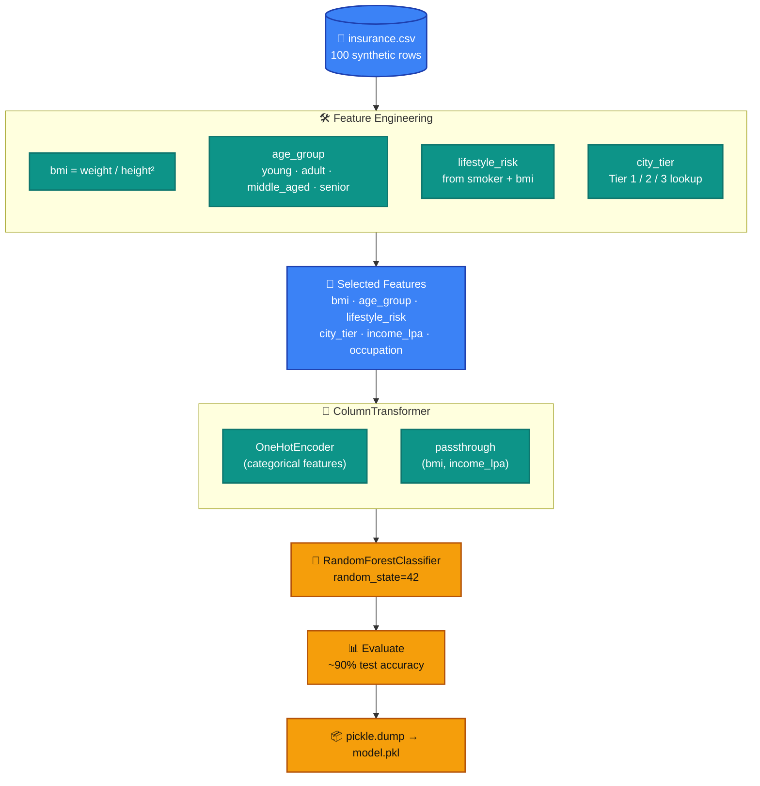
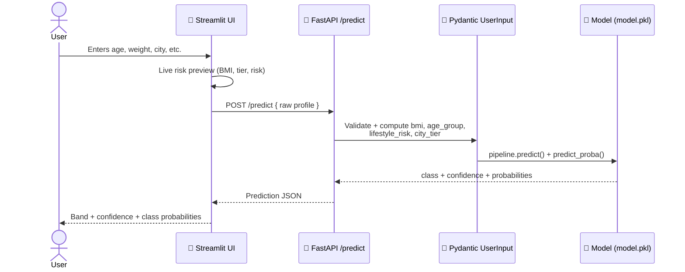

<div align="center">

# 🛡️ InsurePredict

### Insurance Premium Category Predictor

*An end-to-end Machine Learning application that predicts a user's insurance premium band — **Low**, **Medium**, or **High** — from their personal profile.*

<br/>


</div>

---

## 📖 Table of Contents

- [Overview](#-overview)
- [System Architecture](#-system-architecture)
- [The ML Pipeline](#-the-ml-pipeline)
- [Request Lifecycle](#-request-lifecycle)
- [Feature Engineering Reference](#-feature-engineering-reference)
- [Project Structure](#-project-structure)
- [Tech Stack](#-tech-stack)
- [Getting Started](#-getting-started)
- [API Reference](#-api-reference)
- [The Frontend](#-the-frontend)
- [Disclaimer](#-disclaimer)
- [License](#-license)

---

## 🚀 Overview

**InsurePredict** takes a person's everyday details — age, weight, height, income, smoking status, city, and occupation — and predicts which **insurance premium band** they fall into.

The project is a full, cleanly-separated ML system built in four stages:

> **Train** → **Export** → **Serve** → **Consume**

| Stage | What happens | Where |
|-------|--------------|-------|
| 🧠 **Train** | Feature engineering + a `RandomForestClassifier` trained inside a scikit-learn `Pipeline` | [`fastapi_ml_model.ipynb`](fastapi_ml_model.ipynb) |
| 📦 **Export** | The trained pipeline is serialized with `pickle` | `model/model.pkl` |
| 🔌 **Serve** | A **FastAPI** REST API loads the model and exposes a `/predict` endpoint | [`main.py`](main.py) |
| 🎨 **Consume** | A dark-themed **Streamlit** dashboard calls the API and visualizes the result | [`frontend.py`](frontend.py) |

---

## 🏗️ System Architecture



---

## 🧠 The ML Pipeline

The notebook transforms **7 raw inputs** into **6 engineered features**, encodes them, and trains a Random Forest — all wrapped in a single reproducible scikit-learn `Pipeline`.



**In words:**
1. **Feature engineering** — derive `bmi`, `age_group`, `lifestyle_risk`, and `city_tier` from the raw columns.
2. **Split features** — categorical (`age_group`, `lifestyle_risk`, `occupation`, `city_tier`) vs numeric (`bmi`, `income_lpa`).
3. **One-hot encode** the categoricals via a `ColumnTransformer`; pass the numerics through untouched.
4. **Train** a `RandomForestClassifier` on an 80/20 split → **~90% accuracy** on the held-out test set.
5. **Export** the entire fitted pipeline (preprocessing **+** model) to `model.pkl` with `pickle`.

---

## 🔁 Request Lifecycle

What happens end-to-end when a user clicks **"Predict my premium"**:



---

## 📐 Feature Engineering Reference

<table>
<tr><td valign="top" width="50%">

**🏙️ City Tier**

| Tier | Cities |
|------|--------|
| **1** | Metro cities (Mumbai, Delhi, Bangalore, …) |
| **2** | 48 mid-size cities (Jaipur, Indore, Agra, …) |
| **3** | Everything else (default) |

</td><td valign="top" width="50%">

**⚖️ BMI Bands**

| Band | Range |
|------|-------|
| Underweight | `< 18.5` |
| Normal | `18.5 – 24.9` |
| Overweight | `25 – 29.9` |
| Obese | `≥ 30` |

</td></tr>
<tr><td valign="top">

**👤 Age Group**

| Group | Age |
|-------|-----|
| young | `< 25` |
| adult | `< 45` |
| middle_aged | `< 60` |
| senior | `≥ 60` |

</td><td valign="top">

**🚬 Lifestyle Risk**

| Risk | Condition |
|------|-----------|
| **high** | smoker **and** BMI > 30 |
| **medium** | smoker **or** BMI > 27 |
| **low** | neither |

</td></tr>
</table>

---

## 📂 Project Structure

```
insurance-premium-predictor/
├── 📓 fastapi_ml_model.ipynb     # Training notebook: feature eng → pipeline → pickle
├── 🚀 main.py                    # FastAPI app: /, /health, /predict
├── 🎨 frontend.py                # Streamlit dark-themed dashboard
├── 📦 model/
│   ├── model.pkl                 # Serialized sklearn pipeline
│   └── predict.py                # Loads model, returns class + probabilities
├── 🧾 schema/
│   ├── User_Input.py             # Pydantic input model (+ computed features)
│   └── Prediction_Response.py    # Pydantic response model
├── ⚙️ config/
│   └── city_tiers.py             # Tier 1 / Tier 2 city lists
├── 🎛️ .streamlit/
│   └── config.toml               # Dark theme config
└── 📋 requirements.txt
```

---

## 🧰 Tech Stack

| Layer | Technology |
|-------|------------|
| **Language** | Python |
| **ML** | scikit-learn (`RandomForestClassifier`, `Pipeline`, `ColumnTransformer`, `OneHotEncoder`) |
| **Data** | pandas, NumPy |
| **API** | FastAPI + Uvicorn (ASGI) |
| **Validation** | Pydantic (with `computed_field` for derived features) |
| **Frontend** | Streamlit (custom dark theme + injected CSS) |
| **Serialization** | pickle |

---

## ⚙️ Getting Started

### 1. Clone & set up

```bash
git clone https://github.com/<your-username>/insurance-premium-predictor.git
cd insurance-premium-predictor

python -m venv venv
# Windows
venv\Scripts\activate
# macOS / Linux
source venv/bin/activate

pip install -r requirements.txt
# the Streamlit frontend also needs the requests library:
pip install requests
```

### 2. Start the backend (FastAPI)

```bash
uvicorn main:app --reload
```

API runs at **http://127.0.0.1:8000** — interactive docs at **http://127.0.0.1:8000/docs**.

### 3. Start the frontend (Streamlit)

In a second terminal:

```bash
streamlit run frontend.py
```

Dashboard opens at **http://localhost:8501**. The **"API online"** badge turns green once the backend is reachable.

---

## 📡 API Reference

### `GET /`
Health/info message.
```json
{ "message": "Hey it's a Insurance Premium Prediction Model API." }
```

### `GET /health`
Liveness probe for deployment (load balancers / Kubernetes).
```json
{ "status": "OK", "version": "1.0.0", "Model-Loaded": true }
```

### `POST /predict`

**Request body** — raw profile (BMI, age group, lifestyle risk & city tier are computed automatically by Pydantic):

```json
{
  "age": 44,
  "weight": 92.0,
  "height": 1.72,
  "income_lpa": 45.0,
  "smoker": false,
  "city": "Mumbai",
  "occupation": "business_owner"
}
```

**Response:**

```json
{
  "Prediction": {
    "Predicted_class": "High",
    "Confidence_Score": 0.82,
    "Class_Probabilities": { "High": 0.82, "Medium": 0.12, "Low": 0.06 }
  }
}
```

**Try it with `curl`:**

```bash
curl -X POST http://127.0.0.1:8000/predict \
  -H "Content-Type: application/json" \
  -d '{"age":44,"weight":92.0,"height":1.72,"income_lpa":45.0,"smoker":false,"city":"Mumbai","occupation":"business_owner"}'
```

> **Allowed `occupation` values:** `retired`, `freelancer`, `student`, `government_job`, `business_owner`, `unemployed`, `private_job`.

---

## 🎨 The Frontend

The Streamlit dashboard ("InsurePredict") is a **dark-themed**, interactive experience that mirrors the backend's feature engineering in real time. It has three pages:

- **📊 Estimate** — sliders & controls with a **Live Risk Profile** panel (BMI gauge, lifestyle risk, age group, city tier), animated prediction result, confidence badge, and class-probability bars.
- **🔍 How it works** — shows exactly which engineered features are sent to the model, plus BMI / lifestyle / city-tier reference tables.
- **🕓 History** — every prediction from the session, with summary metrics, a bar chart, and CSV export.

---

## ⚠️ Disclaimer

> This model is trained on a **small (100-row) synthetic dataset** and is intended purely for **learning and demonstration**. It is **not** a real underwriting tool and its predictions should **not** be used for any actual insurance decision.

---

## 📄 License

Released under the **MIT License** — free to use, modify, and share.

<div align="center">

---

*Built with ❤️ using FastAPI, scikit-learn & Streamlit*

⭐ **Star this repo if you found it helpful!**

</div>
